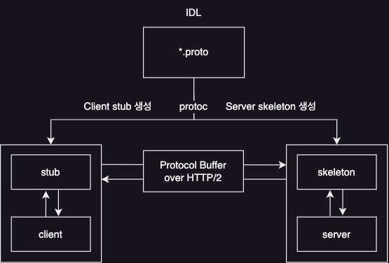

# 1주차

## Summary

1주차에서는 gRPC의 개념과 장단점, 간단한 구현 방법 및 gRPC가 지원하는 4가지 통신 방식에 대해 알아봅니다.

## Concept

### gRPC 개념
gRPC란 분산된 이기종 애플리케이션 사이 원격 함수 호출을 로컬 함수를 호출하는 것만큼 쉽게 할 수 있도록 지원하는 프로세스 간 통신 기술이다.

### 등장배경
RESTful 서비스는 마이크로서비스 기반 애플리케이션 메시징 프로토콜로 사용할 수 없는 몇 가지 제약사항이 있다.

* 비효율적 텍스트 기반 메시지 프로토콜: json 처럼 사람이 읽을 수 있는 텍스트 포맷을 활용한다. 그러나 서비스 간 통신의 경우 사람이 읽을 수 있는 텍스트 기반 포맷을 사용할 필요가 없다. 직접 바이너리 형식으로 전송하는 것이 효율적이다.
* 엄격한 타입 점검 부족: 서비스 정의나 타입 정의가 따로 요구되진 않아 런타임 에러, 상호호환성 이슈 등의 문제를 야기할 수 있다. gRPC는 서버와 클라이언트 중요 코드를 직접 생성해주므로 이러한 문제가 해결된다.
* REST 아키텍처 스타일의 강제화 어려움

gRPC는 이러한 기존 프로세스 간 통신 프로토콜의 한계를 극복하고자 설계되었다.

### gRPC 장점
* 프로세스 간 통신 효율성
* 명확한 서비스 인터페이스와 스키마
* 엄격한 타입 점검
* 폴리그랏
* 이중 스트리밍
* 유용한 내장 기능
* 클라우드 네이티브 생태계와 통합

### gRPC 단점
* gRPC에 익숙하지 않은 외부 클라이언트에게 제공하기에는 부적합 (이 문제의 해결책으로 제시된 것이 gRPC 게이트웨이로 책 8장에서 다룰 예정)
* 개발 프로세스의 복잡성 증가
  * 서비스 정의가 크게 변경된 경우 클라이언트와 서버 코드 모두 다시 생성 필요
  * 해당 과정이 CI 프로세스에 통합되어야 하며 전체 개발 수명 주기를 복잡하게 만들 수 있다.
* REST나 HTTP 프로토콜에 비해 상대적으로 작은 생태계

### 구현 방법

1. IDL 작성: 클라이언트가 원격으로 호출할 수 있는 메서드 및 메서드 파라미터, 메시지 포맷 등을 포함하는 서비스 인터페이스를 정의한다.
2. protoc(프로토콜 버퍼 컴파일러)를 사용해 IDL 기반으로 클라이언트 스텁과 서버 스켈레톤 코드를 생성한다.
3. 서비스 스켈레톤 코드를 바탕으로 비즈니스 로직을 구현한다.
4. gRPC 서버와 클라이언트를 각각 빌드 후 실행하여 통신한다.

### gRPC의 4가지 통신 방식
* 단순/단일 RPC(Unary RPC)
* 서버 스트리밍 RPC
* 클라이언트 스트리밍 RPC
* 양방향 스트리밍 RPC

## Example Case

### project.proto
```protobuf
syntax = "proto3";

import "google/protobuf/empty.proto";

package project;

service ProjectService {
  rpc createProjectByMember(Member) returns (Project);
  rpc deleteProjectByMember(MemberId) returns (google.protobuf.Empty);
}

message Member {
  int64 id = 1;
  string loginId = 2;
  string name = 3;
}

message MemberId {
  int64 value = 1;
}

message Project {
  int64 id = 1;
  string name = 2;
  int64 memberId = 3;
}
```

### Server
```java
public class ProjectGrpcServer {
  
    private static final Logger logger = Logger.getLogger(ProjectGrpcServer.class.getName());
    private Server server;
  
    public void start() throws IOException {
        int port = 50051;
        server = ServerBuilder.forPort(port)
                .addService(new ProjectServiceImpl())
                .build()
                .start();
        logger.info("Server started, listening on {0}", port);
    
        Runtime.getRuntime().addShutdownHook(new Thread(() -> {
            logger.info("*** shutting down gRPC server since JVM is shutting down");
            stop();
            logger.info("*** server shut down");
        }));
    }
}
```

### Client
```java
public class GrpcClientApplication {

    private static final Logger logger = Logger.getLogger(GrpcClientApplication.class.getName());

    public static void main(String[] args) {
        ManagedChannel channel = ManagedChannelBuilder.forAddress("localhost", 50051)
                .usePlaintext()
                .build();

        ProjectServiceGrpc.ProjectServiceBlockingStub stub = ProjectServiceGrpc.newBlockingStub(channel);

        ProjectOuterClass.Project project = stub.createProjectByMember(ProjectOuterClass.Member
                .newBuilder()
                .setId(1L)
                .setLoginId("user1")
                .setName("사용자1")
                .build());

        logger.info("Project [" + project.getName() + "] created.");
        channel.shutdown();
    }
}
```

## Wrap-up
