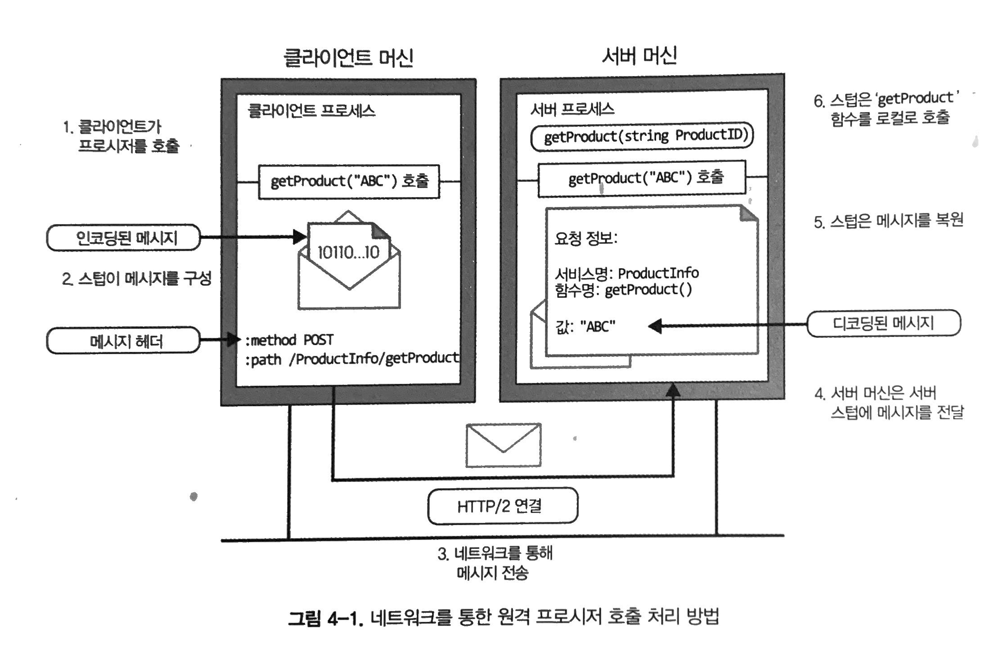

https://www.notion.so/gRPC-chapter-4-84ffe3df54094a6daccafcd57383f9dd?pvs=4

# gRPC chapter 4

생성자: K Lee
생성 일시: 2023년 8월 7일 오후 6:38

# 4장. gRPC: 동작 원리

gRPC 통신 흐름이 구현되는 방법, 사용되는 인코딩 기술, gRPC가 네트워크 통신 기술을 사용하는 방법 등을 살펴본다.

## RPC 흐름

- RPC 시스템에서 서버는 원격으로 호출되는 메서드의 기능을 구현하고, 클라이언트는 서버의 메서드를 호출해서 사용하게 된다.
- 클라이언트는 원격 메서드의 추상화를 제공하는 **스텁**이라는 객체를 통해서 원격 메서드를 사용하게 된다.



- 다른 RPC 시스템과 gRPC의 주요 차이점은 **프로토콜 버퍼를 통한 메시지 인코딩**과 **HTTP/2 연결을 통한 전송**이다.

## 프로토콜 버퍼를 사용한 메시지 인코딩

- gRPC는 **프로토콜 버퍼**를 사용해 gRPC 서비스의 서비스 정의를 작성한다.
- 메시지를 정의하는 방법에 따라 인코딩 방식이 결정되기 때문에, 메시지를 올바르게 작성하는 것이 중요하다.
- 메시지 인스턴스를 만들면 이에 해당하는 바이트는 값 필드의 필드 식별자(= **태그**)와 인코딩된 값으로 구성된다.
- 태그는 **필드 인덱스**와 **와이어 타입**으로 구성된다.
    - 필드 인덱스: 각 메시지 필드에 할당된 고유 번호
    - 와이어 타입: 필드가 가질 수 있는 데이터 타입. 값의 길이를 찾기 위한 정보 제공
    - 태그 값: 필드 인덱스의 바이너리 표현을 세 자리 만큼 왼쪽으로 시프트 후 와이어 타입의 바이너리 값과 비트 OR 연산
    - 예시
        
        다음과 같이 ProductID 메시지 구조에는 필드 인덱스 1과 와이어 타입이 string인 value 라는 하나의 필드가 존재.
        
        ```protobuf
        message ProductID {
        	string value = 1;
        }
        ```
        

### 인코딩 기술

- 데이터 타입에 따라 다양한 인코딩 기술이 적용된다.
- 메시지가 런타임에 효율적으로 인코딩되도록 각 메시지 필드에 가장 적합한 데이터 타입을 설정해야 하므로 인코딩 기술에 대한 지식은 중요하다.
- 가변 길이 정수/부호 있는 정수/비가변 길이 정수 숫자/문자열 타입 등 다양한 인코딩 기술이 존재한다.

- 메시지가 인코딩되면 해당 태그와 값이 바이트 스트림으로 연결되며, 스트림의 끝은 0이라는 태그 값을 전송해 표시한다.


프로토콜 버퍼로 인코딩된 메시지 바이트 스트림 구성

## 길이-접두사 지정 메시지 프레이밍

- 메시지를 전송하기 전에, 상대방이 쉽게 정보를 추출할 수 있는 방식으로 데이터를 패키징하는 메시지 프레이밍이라는 과정을 수행해야한다.
- gRPC는 **'길이-접두사 지정 메시지 프레이밍'**이라는 기술을 사용한다.
- '길이-접두사 지정' 방식은 메시지 자체를 전송하기 전에 **각 메시지의 크기를 기록하는 프레이밍 방식**이다.


- 메시지의 크기는 유한하고, 메시지 크기를 나타내기 위해 4바이트를 할당하기 때문에 gRPC 통신은 최대 4GB 크기의 메시지를 처리할 수 있다.
- 메시지의 크기 외에도 데이터의 압축 여부를 나태내는 1바이트의 부호없는 정수(압축 플래그)가 있다.

## HTTP/2를 통한 gRPC

- HTTP/2는 이전 HTTP/1.1의 보안, 속도 등과 관련된 문제를 개선하고자 도입됐다.
- HTTP/2에서 **클라이언트와 서버 간의 모든 통신은 단일 TCP 연결을 통해 처리**가 되고, **양방향 바이트 흐름**을 전달할 수 있다.
- 네트워크를 통해 요청이나 응답 메시지를 보내기 위해서는 메시지와 함께 추가 헤더를 보내야한다.
- 또한 스트림 종료를 알려줄 수 있는 정보(스트림 종료 플래그, 트레일러)를 전송해야한다.

```
**클라이언트 요청 메시지 -> 요청 헤더 + 길이-접두사 지정 메시지 + 스트림 종료 플래그

서버 응답 메시지 -> 응답 헤더 + 길이-접두사 지정 메시지 + 트레일러**
```

- '길이-접두사 지정 메시지'가 하나의 데이터 프레임(HTTP/2 통신 단위)에 맞지 않으면, **여러 데이터 프레임으로 분리되어 전송**된다.

## gRPC 구현 아키텍처


gRPC-Java stack 

- gRPC 구현은 여러 레이어로 구성되고, 기본 레이어는 **gRPC 코어 레이어**이다.
- gRPC 코어 레이어는 상위 레이어의 **모든 네트워크 작업을 추상화**하여, 개발자가 네트워크를 통해 RPC호출을 쉽게 할 수 있도록 한다.
- 아울러 코어 레이어는 **인증 필터, 데드라인 필터 등 핵심 기능의 확장을 제공**한다.
- gRPC는 언어 바인딩을 제공하기 때문에, 이러한 **언어 바인딩(Generated Stubs) 위에서 애플리케이션 레이어가 구현**된다.
- **언어 바인딩 레이어에서 소스코드가 생성되고, 그렇게 생성된 코드를 사용하여 애플리케이션 로직을 작성**하는 것이다.

## 요약

- gRPC는 프로토콜 버퍼와 HTTP/2라는 빠르고 효율적인 프로토콜 위에서 구축되었다.
- 프로토콜 버퍼는 일반 JSON 페이로드보다 크기가 작고 강력한 형식의 바이너리 페이로드를 생성하고, HTTP/2는 단일 TPC연결을 통해 데이터에 대한 여러 요청을 병렬로 보낼 수 있다.
- 그래서 gRPC 애플리케이션이 다른 애플리케이션보다 더 빠르고 단순하며 견고할 수 있다.
